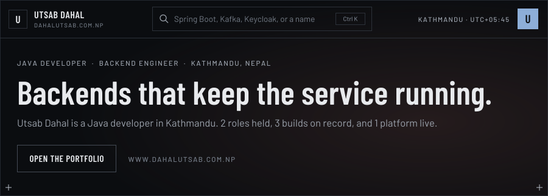
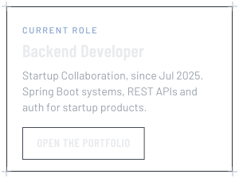
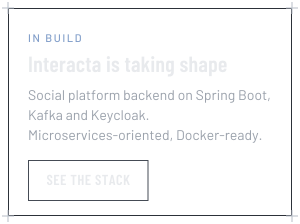
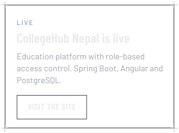
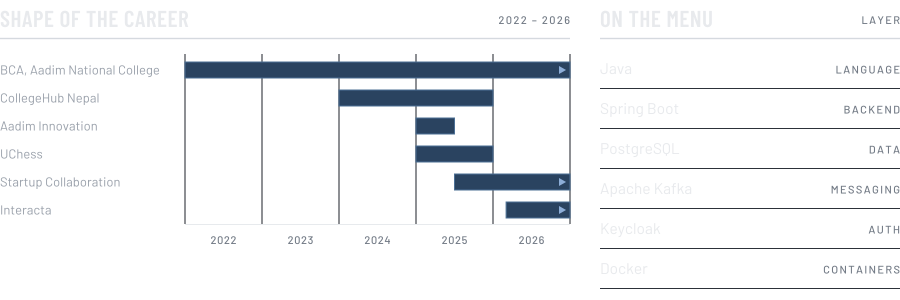
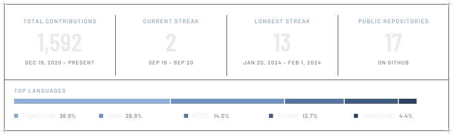

<a href="https://www.dahalutsab.com.np/?utm_source=github&utm_medium=profile_readme&utm_campaign=hero"><picture><source media="(prefers-color-scheme: light)" srcset="assets/hero-light.svg"></picture></a>

I'm **Utsab Dahal**, a **Java developer and Spring Boot backend engineer from Kathmandu, Nepal**. I build production-ready backend applications with **Java, Spring Boot, Hibernate and PostgreSQL**: RESTful APIs, relational schema design, authentication and clean, maintainable architecture. Case files, live projects and contact details are on my portfolio at **[dahalutsab.com.np](https://www.dahalutsab.com.np/?utm_source=github&utm_medium=profile_readme&utm_campaign=intro)**.

 

<picture><source media="(prefers-color-scheme: light)" srcset="assets/h-board-light.svg"></picture>

<a href="https://www.dahalutsab.com.np/?utm_source=github&utm_medium=profile_readme&utm_campaign=card_role"><picture><source media="(prefers-color-scheme: light)" srcset="assets/c-role-light.svg"></picture></a>
<a href="https://www.dahalutsab.com.np/?utm_source=github&utm_medium=profile_readme&utm_campaign=card_interacta"><picture><source media="(prefers-color-scheme: light)" srcset="assets/c-build-light.svg"></picture></a>
<a href="https://collegehubnepal.com"><picture><source media="(prefers-color-scheme: light)" srcset="assets/c-live-light.svg"></picture></a>

 

<picture><source media="(prefers-color-scheme: light)" srcset="assets/shape-light.svg"></picture>

 

<picture><source media="(prefers-color-scheme: light)" srcset="assets/h-profile-light.svg"></picture>

| SPEC | DETAIL |
| :-- | :-- |
| **Role** | Backend Developer, Startup Collaboration (Jul 2025 – present) |
| **Base** | Kathmandu, Nepal (UTC+05:45) |
| **Core** | Java · Spring Boot · Hibernate · PostgreSQL |
| **Ships** | REST APIs · authentication · schema design · microservices |
| **Familiar with** | Docker · Kubernetes · Jenkins · Harbor (hands-on projects) |
| **Study** | BCA, Aadim National College (2022 – present) |
| **Site** | [dahalutsab.com.np](https://www.dahalutsab.com.np/?utm_source=github&utm_medium=profile_readme&utm_campaign=spec) |

 

<picture><source media="(prefers-color-scheme: light)" srcset="assets/h-record-light.svg"></picture>

#### Backend Developer · Startup Collaboration
`JUL 2025 – PRESENT` · Kathmandu, Nepal

- Collaborating with a small development team to build scalable backend systems with **Spring Boot**.
- Designing **REST APIs** and backend architecture for startup products.
- Contributing to database design, authentication and system planning.
- Working closely with frontend developers to deliver end-to-end features.

#### Junior Software Developer · Aadim Innovation
`JAN 2025 – JUN 2025` · Kathmandu, Nepal

- Developed and maintained production-ready backend applications using **Java and Spring Boot**.
- Designed and implemented **RESTful APIs** integrated with Angular frontend applications.
- Built relational data models with **Spring Data JPA, Hibernate and PostgreSQL**.
- Managed database schema migrations with **Flyway**.
- Shipped new features, resolved production issues and improved backend performance.
- Used **Git and Maven** across the full software development lifecycle.

 

<picture><source media="(prefers-color-scheme: light)" srcset="assets/h-builds-light.svg"></picture>

#### Interacta · Social platform backend
`MARCH 2026 – PRESENT` &nbsp; `Spring Boot` `PostgreSQL` `Kafka` `Keycloak` `Docker` `Kubernetes`

- Backend services on Spring Boot and PostgreSQL, following a **microservices-oriented architecture**.
- Authentication and user management powered by **Keycloak**.
- **Event-driven communication** built on Apache Kafka.
- Secure RESTful APIs with backend performance optimization.
- Services containerized with Docker; Kubernetes deployments prepared for learning environments.

#### CollegeHub Nepal · Education platform
`2024 – 2025` &nbsp; `Spring Boot` `Angular` `PostgreSQL` &nbsp; **[Live: collegehubnepal.com](https://collegehubnepal.com)**

- RESTful backend APIs with Spring Boot and PostgreSQL.
- Relational schema design with **role-based access control**.
- Backend modules for colleges, courses, boards and academic content management.
- Angular frontend integrated with secured backend APIs.

#### UChess · Chess engine
`2025` &nbsp; `Java 21` `Spring Boot` `Angular` &nbsp; **[Source: github.com/dahalutsab/chess_core](https://github.com/dahalutsab/chess_core)**

- **UCI-compatible chess engine** written in Java 21.
- Implements **Bitboards, Negamax, Alpha-Beta Pruning, Iterative Deepening and Zobrist Hashing**.
- REST APIs for engine interaction and frontend integration.
- Object-oriented design with backend performance optimization techniques.

More builds and write-ups: **[dahalutsab.com.np](https://www.dahalutsab.com.np/?utm_source=github&utm_medium=profile_readme&utm_campaign=builds)**

 

<picture><source media="(prefers-color-scheme: light)" srcset="assets/h-rack-light.svg"></picture>

| SYSTEM | COMPONENTS |
| :-- | :-- |
| **Languages** | `Java` `SQL` `JavaScript` `TypeScript` |
| **Backend** | `Spring Boot` `Spring Data JPA` `Hibernate` `Spring Security` `REST APIs` |
| **Data** | `PostgreSQL` `MySQL` `Flyway` |
| **Messaging & auth** | `Apache Kafka` `Keycloak` |
| **Frontend** | `Angular` `HTML5` `CSS3` |
| **DevOps** | `Docker` `Kubernetes` `Jenkins` `Harbor` |
| **Tools** | `Git` `Maven` `Swagger / OpenAPI` `Postman` |
| **Concepts** | `Microservices` `Object-Oriented Programming` `Clean Architecture` |

 

<picture><source media="(prefers-color-scheme: light)" srcset="assets/h-records-light.svg"></picture>

| TYPE | RECORD | YEAR |
| :-- | :-- | :-- |
| **Award** | Social Impact Award, Ambition Hackfest | 2025 |
| **Award** | Winner, Aadim National College Intra College Hackathon | 2025 |
| **Training** | DevOps Training, Broadway Infosys, Kathmandu | 2026 |
| **Study** | Bachelor in Computer Application (BCA), Aadim National College | 2022 – present |

 

<picture><source media="(prefers-color-scheme: light)" srcset="assets/h-tele-light.svg"></picture>

<picture><source media="(prefers-color-scheme: light)" srcset="assets/telemetry-light.svg"></picture>

 

<picture><source media="(prefers-color-scheme: light)" srcset="assets/h-contact-light.svg"></picture>

Got a backend project, a product idea, or a team that needs a solid **Java / Spring Boot developer in Nepal**? Start at **[dahalutsab.com.np](https://www.dahalutsab.com.np/?utm_source=github&utm_medium=profile_readme&utm_campaign=contact)** or write to **[info@dahalutsab.com.np](mailto:info@dahalutsab.com.np)**.

<picture><source media="(prefers-color-scheme: light)" srcset="assets/foot-light.svg"></picture>
 
Utsab Dahal · Java Developer in Nepal · Spring Boot Developer in Kathmandu · Backend Engineer · REST API Development · Microservices · PostgreSQL · Apache Kafka · Keycloak · <a href="https://www.dahalutsab.com.np/?utm_source=github&utm_medium=profile_readme&utm_campaign=footer">dahalutsab.com.np</a>

